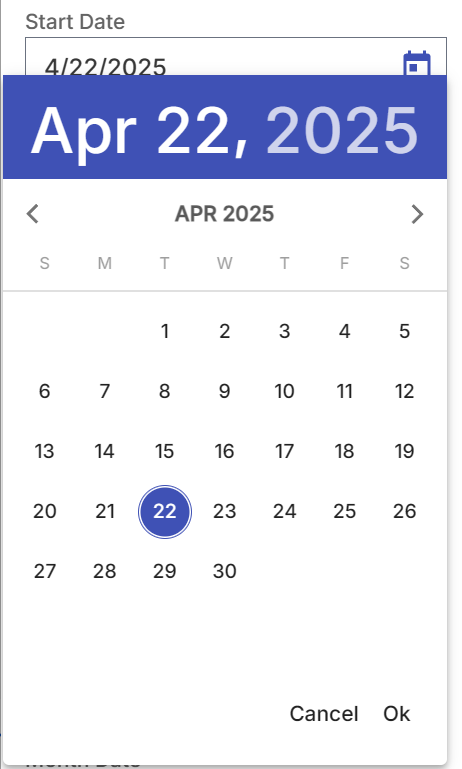
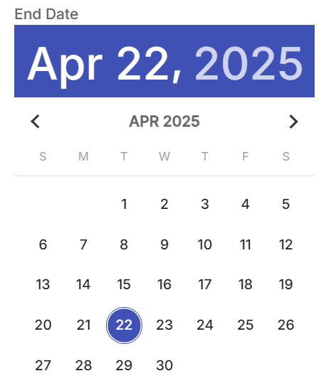
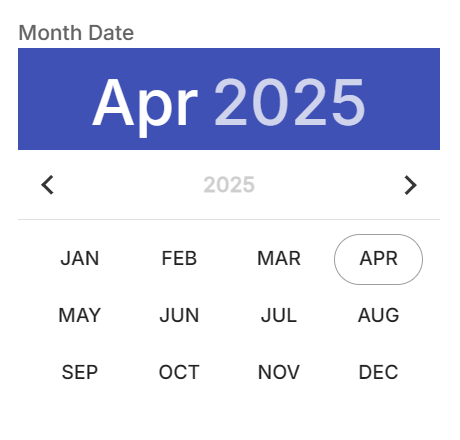
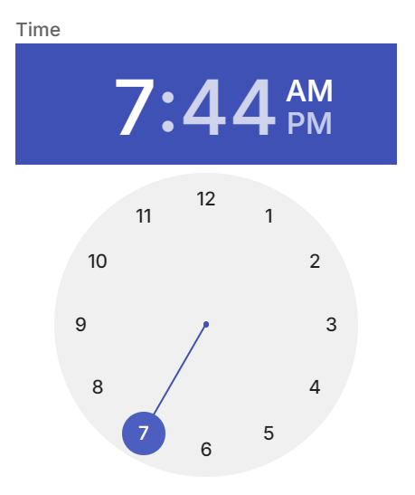
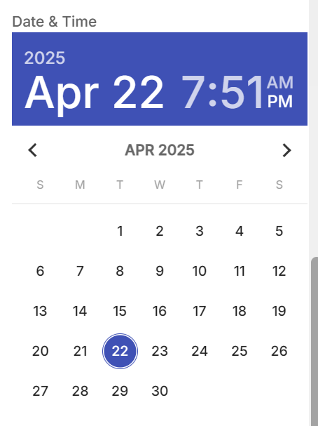

# Calendar Control Descriptor

[datetime-picker](https://h2qutc.github.io/angular-material-components) is used for this control.

| Property | Type | Description |
| - | - | - |
| `mode` | `date` \| `datetime` \| `time` \| `month` \| `year` | Mode of the calendar |
| `minDate` | `Date` | The minimum available date |
| `maxDate` | `Date` | The maximum available date |
| `inline` | `boolean` | Calendar will be displayed inline, not popup. |


## Example:

```json
...
    "settings": [
        {
            "id": "date",
            "label": "Date",
            "type": "calendar",
            "placeholder": "Please choose a date",
            "hint": "You can select date in calendar",
            "info": "Calendar control returns a Javascript Date object"
        },
        ...
    ]
...
```






