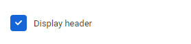

# Checkbox Control Descriptor

No additional settings

## Пример:

```json
...
    "settings": [
        {
            "id": "displayHeader",
            "label": "Display header",
            "type": "checkbox",
            "default": true
        },
        ...
    ]
...
```
<!--
Result (todo: renew images)


-->