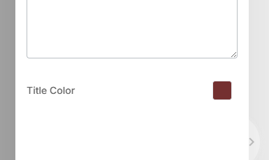
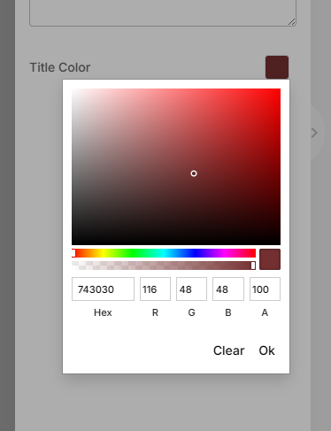
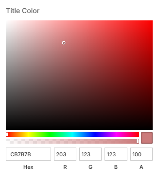

# Color Control Descriptor

The [color picker](https://ngx-color.vercel.app/) is used for this editor. The [npm-package](https://www.npmjs.com/package/ngx-color) is available too.

| Property | Type | Description |
| - | - | - |
| `colorMode` | `color` \| `presets` | Sketch picker is used for `color` mode. Twitter picker is used for `presets`. |
| `disableAlpha` | `boolean` | Remove alpha slider and options from picker. |
| `clearValue` | `string` | Value for clear button. |
| `inline` | `boolean` | Display picker inline. |
| `presets` | `string[]` | List of values for presets mode. |

## Example:

```json
...
    "settings": [
        {
            "id": "headerColor",
            "label": "Header color",
            "type": "color",
            "outputFormat": "hsla"
        },
        ...
    ]
...
```





```json
...
    "settings": [
        {
            "id": "headerColor",
            "label": "Header color",
            "type": "color",
            "inline": "true"
        },
        ...
    ]
...
```


