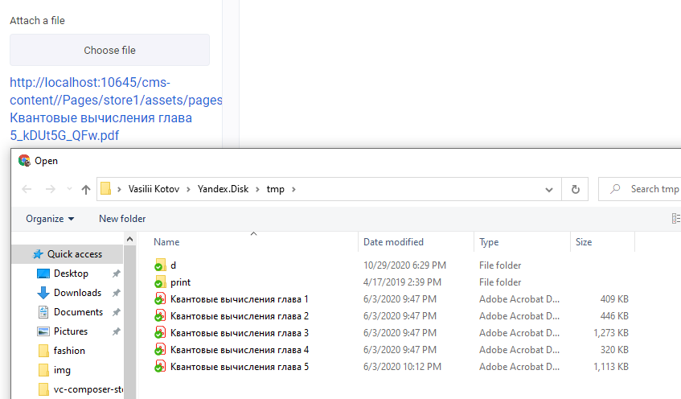

# file control descriptor

| Property | Type | Description |
| ---| --- | --- |
| `acceptTypes`   | `string`  | допустимые расширения, либо mime-types для загружаемых файлов, подставляется напрямую в свойство [accept](https://developer.mozilla.org/en-US/docs/Web/HTML/Element/input/file#accept). |

Результатом этого контрола является ссылка на загруженный файл

## Пример

```json
...
    "settings": [
        {
            "id": "attachment",
            "label": "Attach a file",
            "type": "file",
            "acceptTypes": ".pdf,application/pdf"
        },
        ...
    ]
...
```

Результат


