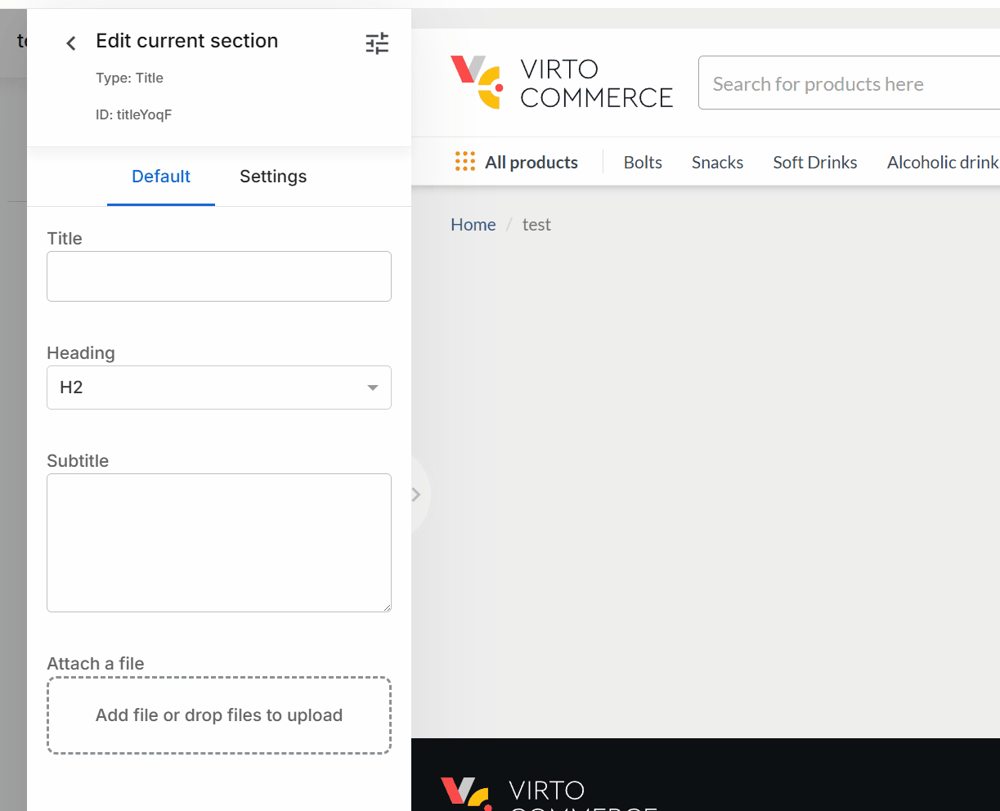
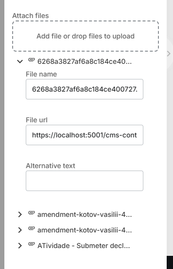

# Files Control Descriptor

[file-upload](https://pivan.github.io/file-upload/) component is used for this control.
The [npm-package](https://www.npmjs.com/package/@iplab/ngx-file-upload) is available too.

| Property | Type | Description |
| - | - | - |
| `accept` | `string` | Acceptable files extensions or mime-types, used directly in attribute [accept](https://developer.mozilla.org/en-US/docs/Web/HTML/Element/input/file#accept). |
| `multiple` | `boolean` | Allow multiple files uploading. Default `true`. |
| `sortable` | `boolean` | Allow sort files. Default `true`. |
| `maxFileSize` | `number` | Maximum file size. |
| `collapseThreshold` | `number` | Count of files after that panel with preview will be collapsed. Default is 6. |
| `collapseCount` | `number` | Number of files that will be shown in collapsed state. Default is 4. |
| `skipRemoveConfirmation` | `boolean` | Ask user to confirm file removing. |
| `removeMessage` | `string` | Message for file removing confirmation. |
| `urlField` | `string` | Name of field with `url` if item is object. |
| `filenameField` | `string` | Name of field with `filename` if item is object. |
| `element` | `ControlDescriptor[]` | Descriptors for other field of object. |
| `uploadAssetsRequest` | `AssetsRequest` \| `string` \| `inline` | Custom request for upload asset. |

Value of this control is array of urls or objects if `element` property is defined.

If `uploadAssetsRequest` is `inline`, the file will be converted into `base64` and stored directly into page, without uploading to server. Such image can be used as the [data url](https://developer.mozilla.org/en-US/docs/Web/URI/Reference/Schemes/data).

If `uploadAssetsRequest` is `string`, it should be property name from the [builder settings](../_builder-settings.md) object.

Also it can be just [ServerRequestDescriptor](../_server-request-descriptor.md) object, which will be used to upload files to server.

If `uploadAssetsRequest` is not defined, the default request will be used, which is defined in [builder settings](../_builder-settings.md) as `uploadAssetsRequest`.


## Example

### Single file

```json
...
    "settings": [
        {
            "id": "attachment",
            "label": "Attach a file",
            "type": "files",
            "multiple": false,
            "accept": ".pdf,application/pdf"
        },
        ...
    ]
...
```
Result



```json
...
    "content": [
        {
            "attachment": "https://localhost:5001/cms-content/Pages/B2B-store/assets/pages/contract.pdf"
            ...
        },
        ...
    ]
```

### Multiple files

```json
...
    "settings": [
        {
            "id": "attachments",
            "label": "Attach files",
            "type": "files",
            "accept": ".pdf,application/pdf"
        },
        ...
    ]
...
```

Result


```json
...
    "content": [
        {
            "attachments": [
              "https://localhost:5001/cms-content/Pages/B2B-store/assets/pages/2-requerimento.pdf",
              "https://localhost:5001/cms-content/Pages/B2B-store/assets/pages/89e49b95-98e5-43fe-a250-3746af0660bf.pdf",
              "https://localhost:5001/cms-content/Pages/B2B-store/assets/pages/6268a3827af6a8c184ce400727.pdf",
              ...
            ]
            ...
        },
        ...
    ]
```

### Files as objects

```json
...
    "settings": [
        {
            "id": "attachments",
            "label": "Attach files",
            "type": "files",
            "urlField": "url",
            "filenameField": "filename",
            "element": [
                {
                    "id": "filename",
                    "type": "string",
                    "label": "File name"
                },
                {
                    "id": "url",
                    "type": "string",
                    "label": "File url"
                },
                {
                    "id": "altText",
                    "type": "string",
                    "label": "Alternative text"
                }
            ]
        },
        ...
    ]
```

Result



```json
...
    "content": [
        {
            "attachments": [
                {
                    "filename": "2-requerimento.pdf",
                    "url": "https://localhost:5001/cms-content/Pages/B2B-store/assets/pages/2-requerimento.pdf",
                    "altText": "Requerimento"
                },
                {
                    "filename": "89e49b95-98e5-43fe-a250-3746af0660bf.pdf",
                    "url": "https://localhost:5001/cms-content/Pages/B2B-store/assets/pages/89e49b95-98e5-43fe-a250-3746af0660bf.pdf",
                    "altText": "Another file"
                },
                ...
            ]
            ...
        },
        ...
    ]
```
