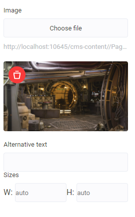

# image control descriptor

| Property        | Type      | Description                                                                                                                                                                            |
| --------------- | --------- | -------------------------------------------------------------------------------------------------------------------------------------------------------------------------------------- |
| `previewWidth`  | `number`  | ширина превью изображения в редакторе                                                                                                                                                  |
| `previewHeight` | `number`  | высота превью изображения в редакторе                                                                                                                                                  |
| `allowSetSize`  | `boolean` | добавить возможность пользователю указать размеры                                                                                                                                      |
| `acceptTypes`   | `string`  | допустимые расширения, либо mime-types для загружаемых файлов, подставляется напрямую в свойство [accept](https://developer.mozilla.org/en-US/docs/Web/HTML/Element/input/file#accept). |
| `inline`        | `boolean` | если `true`, то изображение не будет загружаться на сервер, а будет сохранено в блоке в формате `data:`                                                                                |


## ImageDescriptor

Редактор изображения возвращает структуру типа `ImageDescriptor`, которая присваивается свойству блока

| Property  | Type     | Description                                                    |
| --------- | -------- | -------------------------------------------------------------- |
| `url`     | `string` | ссылка на изображение, либо само изображение в формате `data:` |
| `width`   | `number` | ширина изображения                                             |
| `height`  | `number` | высота изображение                                             |
| `altText` | `string` | alt-текст                                                      |

## Пример

```json
...
    "settings": [
        {
            "id": "image",
            "label": "Image",
            "type": "image",
            "allowSetSize": true,
            "default": {
                "url": "/themes/assets/blocks/portfolio.png"
            }
        },
        ...
    ]
...
```

Результат


