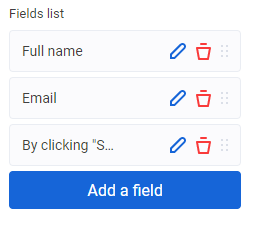
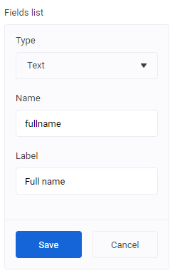

# Collection Control Descriptor

|Property|Type|Description|
| - | - | - |
| `addText` | `string` | Add element button text. Default is `Add item` |
| `displayField` | `string` | Property name that is used to display collection item in list. |
| `skipRemoveConfirmation` | `boolean` | Ask user to confirm file removing. |
| `removeMessage` | `string` | Message for the file removing confirmation. |
| `elementDescriptor` | `string` | Name of object in `objects` folder. |
| `element` | `ControlDescriptor[]` | Descriptors for collection item. |

## Example

```json
...
    "settings": [
        {
            "id": "formFields",
            "label": "Fields list",
            "type": "list",
            "addText": "Add a field",
            "displayField": "labelText",
            "element": [
                {
                    "id": "fieldType",
                    "label": "Type",
                    "type": "select",
                    "default": "text",
                    "options": [
                        { "value": "checkbox", "label": "Checkbox" },
                        { "value": "text", "label": "Text" }
                    ]
                },
                {
                    "id": "fieldName",
                    "label": "Name",
                    "type": "string"
                },
                {
                    "id": "labelText",
                    "label": "Label",
                    "type": "string"
                }
            ],
            "default": [
                {
                    "fieldType": "text",
                    "fieldName": "fullname", "labelText": "Full name"
                },
                {
                    "fieldType": "text",
                    "fieldName": "email",
                    "labelText": "Email"
                },
                {
                    "fieldType": "checkbox",
                    "fieldName": "accept",
                    "labelText": "By clicking \"Submit\" I understand that I consent to opt-in to the Terms and Policy"
                }
            ]
        },
        ...
    ]
...
```
<!--
Result (todo: renew images)



Edit element mode



-->