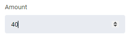

# number control descriptor

|Property|Type|Description|
|-|-|-|
| `min` | `number` | минимальное значение |
| `max` | `number` | максимальное значение |
| `step` | `number` | шаг |

## Пример

```json
...
    "settings": [
        {
            "id": "amount",
            "type": "number",
            "label": "Amount",
            "min": 10,
            "max": 50,
            "step": 5
        },
        ...
    ]
...
```

Результат



