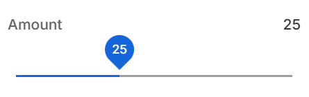

# Number Control Descriptor

| Property | Type | Description |
| - | - | - |
| `min` | `number` | Minimum value |
| `max` | `number` | Maximum value |
| `step` | `number` | Value change step |
| `thumb` | `boolean` | Display value in thumb of slider |

## Examples

```json
...
    "settings": [
        {
            "id": "amount",
            "type": "number",
            "label": "Amount",
            "min": 10,
            "max": 50,
            "step": 5
        },
        ...
    ]
...
```

Result


```json
...
    "settings": [
        {
            "id": "amount",
            "type": "slider",
            "label": "Amount",
            "min": 10,
            "max": 50,
            "step": 5,
            "thumb": true
        },
        ...
    ]
...
```

Result



