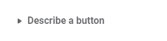
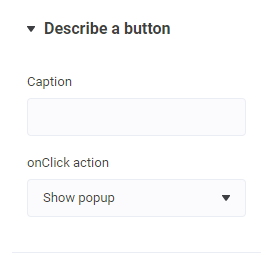
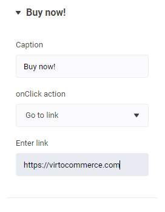

# Object Control Descriptor

| Property | Type | Description |
| - | - | - |
| `title` | `string` | Object title |
| `displayField` | `string` | Property name that is used to display object in collapsed state |
| `element` | `ControlDescriptor[]` | List of descriptors that define object editor. |
| `elementDescriptor` | `string` | Name of object in `objects` folder. |

## Examples

### Inline settings

```json
...
    "settings": [
        {
            "id": "button",
            "label": "Describe a button",
            "type": "object",
            "title": "The button",
            "displayField": "caption",
            "element": [
                {
                    "id": "caption",
                    "type": "string",
                    "label": "Caption"
                },
                {
                    "id": "action",
                    "type": "select",
                    "label": "onClick action",
                    "default": "popup",
                    "options": [
                        { "label": "Show popup", "value": "popup" },
                        { "label": "Go to link", "value": "url" }
                    ]
                },
                {
                    "id": "url",
                    "type": "string",
                    "label": "Enter link",
                    "visibility": "!!this.item && this.item.action === 'url'"
                }
            ]
        },
        ...
    ]
...
```

<!--
Result (todo: renew images)



Result (todo: renew images)



Result (todo: renew images)



Result in target section.

-->

```json
{
    "button": {
        "caption": "Buy now!",
        "action": "url",
        "url": "https://virtocommerce.com"
    }
}
```

### Example with elementDescriptor

File `buttonEditor` is placed in `theme/config/objects/` folder

```json
{
    "settings": [
        {
            "id": "caption",
            "type": "string",
            "label": "Caption"
        },
        {
            "id": "action",
            "type": "select",
            "label": "onClick action",
            "default": "popup",
            "options": [
                { "label": "Show popup", "value": "popup" },
                { "label": "Go to link", "value": "url" }
            ]
        },
        {
            "id": "url",
            "type": "string",
            "label": "Enter link",
            "visibility": "!!this.item && this.item.action === 'url'"
        }
    ]
}
```
Now you can use this object in different sections.

```json
{
    ...
    "settings": [
        {
            "id": "button",
            "label": "Describe a button",
            "type": "object",
            "title": "The button",
            "displayField": "caption",
            "elementDescriptor": "buttonEditor"
        },
        ...
    ]
}
```
