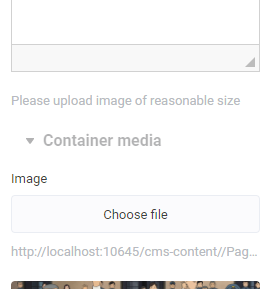

# paragraph control descriptor

| Property  | Description |
| - | - |
| `content` | Text to display in editor panel. |

## Example:

```json
...
    "settings": [
        {
            "type": "paragraph",
            "content": "Please upload image of reasonable size"
        },
        ...
    ]
...
```
<!--
Result (todo: renew images)


-->