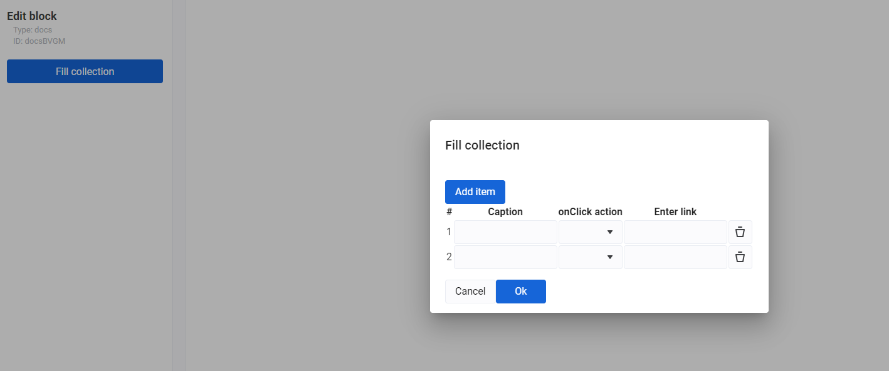

# popup-list control descriptor

Позволяет редактировать коллекцию элементов в табличном виде во всплывающем окне.

Для отображения popup используется модуль [`MatDialogModule`](https://material.angular.io/components/dialog/overview) из [`Angular Material`](https://material.angular.io/).


| Property | Type | Description |
| --- | --- | --- |
| `title` | `string` | Заголовок окна |
| `addText` | `string` | Текст кнопки для добавления элемента |
| `removeText` | `string` | Текст кнопки для удаления элемента, в текущем интерфейсе не используется |
| `element` | `ControlDescriptor[]` | Описание свойств элемента результирующего массива. Точно так же как в [`list`](list.md) |
| `options` | `MatDialogConfig` | параметры окна, [`MatDialogConfig`](https://material.angular.io/components/dialog/api#MatDialogConfig) |

## Пример


```json
...
    "settings": [
        {
            "id": "items",
            "label": "Fill collection",
            "type": "popup-list",
            "addText": "Add item",
            "element": [
                {
                    "id": "caption",
                    "type": "string",
                    "label": "Caption"
                },
                {
                    "id": "action",
                    "type": "select",
                    "label": "onClick action",
                    "default": "popup",
                    "options": [
                        { "label": "Show popup", "value": "popup" },
                        { "label": "Go to link", "value": "url" }
                    ]
                },
                {
                    "id": "url",
                    "type": "string",
                    "label": "Enter link"
                }
            ]
        },
        ...
    ]
...
```

Результат


