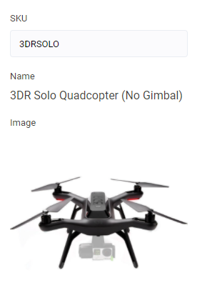
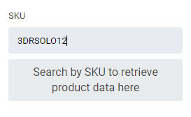
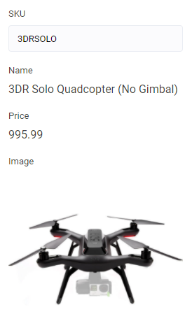
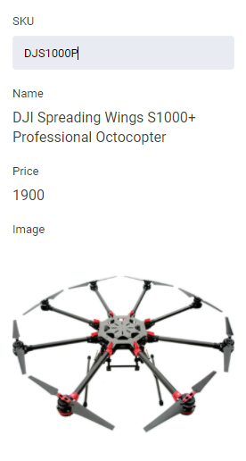

# search control descriptor

Этот контрол предназначен для выполнения запроса/запросов для введённых данных. Возвращает результат, который сохраняется в блоке.

| Property | Type | Description |
| --- | --- | --- |
| `request` | `ServerRequestDescriptor` | Описание запроса ***todo: ссылка на описание запроса*** |
| `requests` | `{ [key: string]: ServerRequestDescriptor }` | Используется в случаях когда необходимо выполнить несколько запросов |
| `displayInfo` | `DisplaySearchResult[]` | Описание результата, который будет отображен в контроле |
| `nodataText` | `string` | Текст, выводимый, если запрос вернул пустой результат |
| `button` | `boolean \| string` | Текст на кнопке для инициации запроса, если `false`, кнопка не выводится, запрос выполняется на изменение текстового поля |

Поле для ввода строки не выводится вместе с кнопкой.

`requests` игнорируется если есть свойство `request`.

`requests` выполняет запросы по очереди, в порядке их описания. Результат записывается в соответствующее свойство.

Результат выполнения `request` записывается в свойство `value`.

## Примеры

### Пример с одним запросом

<details>
    <summary>Expand</summary>

```json
...
    "settings": [
        {
            "id": "product",
            "label": "SKU",
            "sort": 1,
            "type": "search",
            "nodataText": "Search by SKU to retrieve product data here",
            "default": {
                "value": {
                    "id": "9cbd8f316e254a679ba34a900fccb076",
                    "name": "3DR Solo Quadcopter (No Gimbal)",
                    "imgSrc": "/themes/assets/blocks/solo-quadcopter.jpg",
                    "description": "<ul class=\"top-section-list\">&#10;<li class=\"top-section-list-item\">Capture Aerial Photos/Video with a GoPro</li>&#10;<li class=\"top-section-list-item\">Linear Tracking with Cablecam Mode</li>&#10;<li class=\"top-section-list-item\">Follow Me: Tracks Your Mobile Device</li>&#10;<li class=\"top-section-list-item\">HDMI Output on Transmitter</li>&#10;<li class=\"top-section-list-item\">Android and iOS Mobile Apps</li>&#10;<li class=\"top-section-list-item\">Video Game-Style Controls</li>&#10;<li class=\"top-section-list-item\">Return Home and &#34;Safety Net&#34; Modes</li>&#10;<li class=\"top-section-list-item\">One-Button Flying / &#34;Pause&#34; Button</li>&#10;<li class=\"top-section-list-item\">Operate GoPro Through App</li>&#10;<li class=\"top-section-list-item\">Works with Optional Solo Gimbal</li>&#10;</ul>",
                    "price": "$995.99",
                    "url": "3dr-solo-quadcopter-no-gimbal"
                },
                "__nodata": false,
                "__searchQuery": "3DRSOLO"
            },
            "displayInfo": [
                {
                    "label": "Name",
                    "key": "name"
                },
                {
                    "label": "Image",
                    "key": "imgSrc",
                    "type": "image"
                }
            ],
            "request": {
                "url": "/api/reverse-proxy/{{location.params.storeId}}/virtocommerce/graphql",
                "method": "post",
                "isArray": false,
                "body": {
                    "operationName": null,
                    "variables": {},
                    "query": "{products(storeId:\"odt\",filter:\"sku:{{__searchQuery}}\",userId:\"\"){items{id,code,name,imgSrc,descriptions{reviewType,content}prices{currency,list{formattedAmount}}seoInfo{semanticUrl}}}}"
                },
                "response": {
                    "result": "data.products.items",
                    "isArray": false,
                    "value": [
                        "id",
                        "name",
                        "code",
                        "imgSrc",
                        {
                            "key": "description",
                            "query": "$.descriptions[?(@.reviewType=='QuickReview')].content",
                            "isArray": false
                        },
                        {
                            "key": "price",
                            "query": "$.prices[?(@.currency=='USD')].list.formattedAmount",
                            "isArray": false
                        },
                        {
                            "key": "url",
                            "query": "$.seoInfo.semanticUrl",
                            "isArray": false
                        }
                    ]
                }
            }
        },
        ...
    ]
...
```

При изменении текста в поле ввода, будет выполняться запрос и может быть получен такой результат:



Если запрос не вернул данных, то в результате отобьразится строка из свойства `nodataText`



</details>

### Пример с несколькими запросами

Может возникнуть ситуация, при которой для получения целостностного объекта необходимо сделать несколько запросов, например получить товар по его артикулу (`sku`), а затем по идентификатору полученного товара получить его цену.

<details>
    <summary>Expand</summary>

```json
...
    "settings": [
        {
            "id": "product",
            "label": "SKU",
            "sort": 1,
            "type": "search",
            "nodataText": "Search by SKU to retrieve product data here",
            "default": {
                "product": {
                    "id": "9cbd8f316e254a679ba34a900fccb076",
                    "name": "3DR Solo Quadcopter (No Gimbal)",
                    "imgSrc": "/themes/assets/blocks/solo-quadcopter.jpg",
                    "description": "<ul class=\"top-section-list\">&#10;<li class=\"top-section-list-item\">Capture Aerial Photos/Video with a GoPro</li>&#10;<li class=\"top-section-list-item\">Linear Tracking with Cablecam Mode</li>&#10;<li class=\"top-section-list-item\">Follow Me: Tracks Your Mobile Device</li>&#10;<li class=\"top-section-list-item\">HDMI Output on Transmitter</li>&#10;<li class=\"top-section-list-item\">Android and iOS Mobile Apps</li>&#10;<li class=\"top-section-list-item\">Video Game-Style Controls</li>&#10;<li class=\"top-section-list-item\">Return Home and &#34;Safety Net&#34; Modes</li>&#10;<li class=\"top-section-list-item\">One-Button Flying / &#34;Pause&#34; Button</li>&#10;<li class=\"top-section-list-item\">Operate GoPro Through App</li>&#10;<li class=\"top-section-list-item\">Works with Optional Solo Gimbal</li>&#10;</ul>",
                    "url": "3dr-solo-quadcopter-no-gimbal"
                },
                "price": {
                    "effectiveValue": "995.99"
                },
                "__nodata": false,
                "__searchQuery": "3DRSOLO"
            },
            "displayInfo": [
                {
                    "label": "Name",
                    "path": "product.name"
                },
                {
                    "label": "Price",
                    "path": "price.effectiveValue"
                },
                {
                    "label": "Image",
                    "path": "product.imgSrc",
                    "type": "image"
                }
            ],
            "requests": {
                "product": {
                    "url": "/api/reverse-proxy/{{location.params.storeId}}/odt/api/catalog/search/products",
                    "method": "post",
                    "isArray": false,
                    "body": {
                        "objectType": "Product",
                        "storeId": "odt",
                        "catalogId": "4974648a41df4e6ea67ef2ad76d7bbd4",
                        "searchPhrase": "{{__searchQuery}}",
                        "skip": 0,
                        "take": 1
                    },
                    "response": {
                        "result": "items",
                        "isArray": false,
                        "value": [
                            "id",
                            "name",
                            "code",
                            "imgSrc",
                            {
                                "key": "description",
                                "query": "$.reviews[?(@.reviewType=='QuickReview')].content",
                                "isArray": false
                            },
                            {
                                "key": "url",
                                "query": "$.seoInfos[0].semanticUrl",
                                "isArray": false
                            }
                        ]
                    }
                },
                "price": {
                    "url": "/api/reverse-proxy/{{location.params.storeId}}/odt/api/products/{{item.product.id}}/prices",
                    "method": "get",
                    "response": {
                        "result": "$",
                        "isArray": false,
                        "value": [
                            "effectiveValue"
                        ]
                    }
                }
            }
        },
        ...
    ]
...
```

На что стоит обратить внимание:
1. `displayInfo` использует свойство `path` для получения отображаемых значений. Путь строится от самого значения (см. свойство `default`).
2. для описания запросов используется свойство `requests`.
3. запросы могут использовать значения полученные на предыдущем шаге, для построения нового запроса (см. свойство `url` у `price`).

Ниже представлен результат такой настройки контрола.

Значение по умолчанию:



Если изменить артикул:



</details>

Более детальное описание запросов и их парсинга см. на странице [`request`](../request.md)
