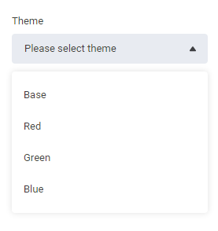
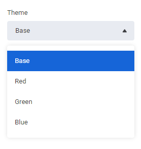
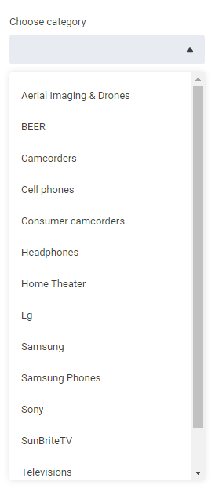
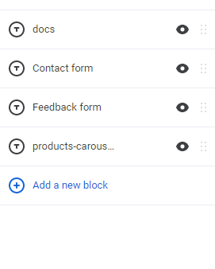
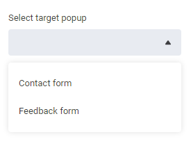

# select control descriptor

| Property | Type | Description |
| --- | --- | --- |
| `options` | `OptionModel[]` | набор вариантов для `select` |
| `optionsSelector` | `string` | выбор вариантов из текущего контекста [`ComponentContext`](../component-context.md) |
| `request` | `OptionsRequest` | загрузка вариантов с помощью веб-запроса ***todo: ссылка на описание запроса*** |
| `equalKey` | `string` | ключ сравнения вариантов |
| `filterList` | `boolean` | можно ли фильтровать варианты |
| `multiple` | `boolean` | возможность множественного выбора ***todo: (не реализовано)*** |

В свойстве `options` задаётся масссив значений, которые будут доступны в выпадающем списке. Эти значения могут быть сгруппированы свойством `group`.

В свойстве `request` можно указать запрос, который будет выполняться для получения данных, в качестве отображаемого значения используется свойство из `label`. А в качестве значения, элемент списка. Полученные данные мерджатся со списком из свойства `options`.

В свойстве `optionsSelector` можно указать js-скрипт, который исполняется в контексте [`ComponentContext`](../component-context.md) и должен возвращать массив.

Например:

```js
this.page.filter(function(x) { return x.type==='popup' }).map(function(x) { return { label: x.name || x.__id, value: x.__id }; })
```

Этот скрипт берёт все блоки страницы, фильтрует их по типу, а затем выбирает нужные значения.

Результат также мерджится со списком из свойства `options`.

Если контролу было передано какое-то значение, то после загрузки данных, оно ищется при помощи значения свойства `equalKey`.

Свойство `optionsSelector` игнорируется, если указано свойство `request`.

## OptionsRequest

наследуется от `ServerRequestDescriptor`, добавлены свойства `group` и `label`. Оба свойства типа `string`, в них указаны имена свойств, по которым берутся значения из ответа с сервера.

Более подробно формирование запроса описано на странице [`request`](../request.md).

## OptionModel

| Property | Type | Description |
| --- | --- | --- |
| `label` | `string` | подпись |
| `value` | `any` | значение |
| `group` | `string` | название группы |

## Примеры

### Обычный селект

<details>
    <summary>Expand</summary>

```json
...
    "settings": [
        {
            "id": "theme",
            "type": "select",
            "label": "Theme",
            "placeholder": "Please select theme",
            "options": [
                { "label": "Base", "value": "base" },
                { "label": "Red", "value": "red" },
                { "label": "Green", "value": "green" },
                { "label": "Blue", "value": "blue" }
            ]
        },
        ...
    ]
...
```

Результат



Если указать значение по умолчанию, то оно будет автоматически выбрано.

```json
...
    "settings": [
        {
            "id": "theme",
            "type": "select",
            "label": "Theme",
            "placeholder": "Please select theme",
            "default": "base",
            "options": [
                { "label": "Base", "value": "base" },
                { "label": "Red", "value": "red" },
                { "label": "Green", "value": "green" },
                { "label": "Blue", "value": "blue" }
            ]
        },
        ...
    ]
...
```

Результат



</details>

### Запрос на сервер

<details>
    <summary>Expand</summary>

```json
...
    "settings": [
        {
            "id": "category",
            "label": "Choose category",
            "type": "select",
            "equalKey": "id",
            "default": null,
            "request": {
                "url": "/api/reverse-proxy/{{location.params.storeId}}/odt/api/catalog/search/categories",
                "method": "post",
                "body": {
                    "objectType": "Category",
                    "catalogId": "4974648a41df4e6ea67ef2ad76d7bbd4"
                },
                "response": {
                    "result": "items",
                    "isArray": true,
                    "value": [
                        "id",
                        "name"
                    ]
                },
                "label": "name"
            }
        },
        ...
    ]
...
```

Результат



</details>

### Выбор из контекста

<details>
    <summary>Expand</summary>

```json
...
    "settings": [
        {
            "id": "popupId",
            "label": "Select target popup",
            "type": "select",
            "optionsSelector": "this.page.filter(x => x.type==='popup').map(x => ({ label: x.name || x.__id, value: x.__id }))"
        },
        ...
    ]
...
```

Результат

На страницу добавлено 4 контрола, 2 из них типа `popup`.



У пользователя есть возможность выбрать нужный блок



</details>
