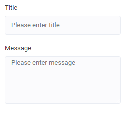

# String Control Descriptor

| Property | Type | Description |
| - | - | - |
| `multiline`   | `boolean` | Allow to enter text in multiple rows |

## Example:

```json
...
    "settings": [
        {
            "id": "title",
            "type": "string",
            "label": "Title",
            "placeholder": "Please enter title"
        },
        {
            "id": "message",
            "type": "string",
            "label": "Message",
            "placeholder": "Please enter message",
            "multiline": true
        },
        ...
    ]
...
```

<!--
Result (todo: renew images)


-->