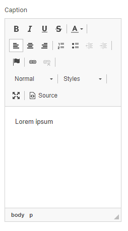

# text control descriptor

Wysiwyg-editor. [ckeditor-angular](https://www.npmjs.com/package/ckeditor4-angular) is used.

| Property | Type | Description |
| - | - | - |
| `config`   | `object` | Config for underlay editor. |


## Example:

```json
...
    "settings": [
        {
            "id": "caption",
            "type": "text",
            "label": "Caption",
            "default": "Lorem ipsum"
        },
        ...
    ]
...
```
<!--
Result (todo: renew images)


-->