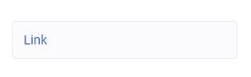
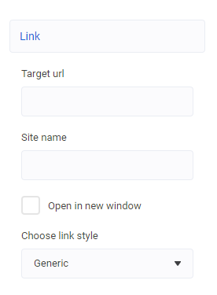
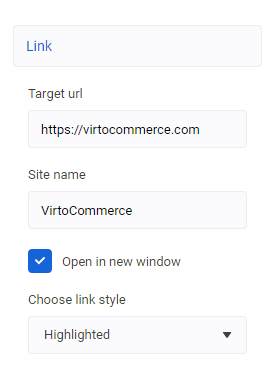

# url control descriptor

Можно использовать для описания ссылки.

| Property | Type | Description |
| --- | --- | --- |
| `styles` | `OptionModel[]` | Список стилей для стилизации ссылки |
| `openInNewTab` | `boolean` | Показывать ли настройку для открытия ссылки в новом окне |
| `urlLabel` | `string` | Подпись для редактора ссылки |
| `textLabel` | `string` | Подпись для редактора текста ссылки |
| `styleLabel` | `string` | Подпись для коллекции стилей |
| `openInNewTabLabel` | `string` | Подпись для флага открытия в новом окне |


## Пример

```json
...
    "settings": [
        {
			"id": "link",
			"label": "Link",
			"type": "url",
			"urlLabel": "Target url",
			"textLabel": "Site name",
			"openInNewTabLabel": "Open in new window",
			"openInNewTab": true,
			"styleLabel": "Choose link style",
			"styles": [
				{ "label": "Generic", "value": null },
				{ "label": "Highlighted", "value": "link__url--highlighed" }
			]
        },
        ...
    ]
...
```

Результат в свёрнутом состоянии



Результат в развёрнутом состоянии



Результат с заполненными данными



Свойство блока будет выглядеть следующим образом

```json
{
    "link": {
        "url": "https://virtocommerce.com",
        "urlText": "VirtoCommerce",
        "style": "link__url--highlighted",
        "openInNewTab": true
    }
}
```
