# Create a Landing Page

Landing pages can help you optimize ecommerce site.

First, Landing pages help to capture customer's specific intent based on what they are actually searching for. 
These searches can capture any sort of intent - searches for products, services, information, and more. 
The corresponding landing pages are able to provide specific information that answers the consumer's question in search.

Second, In digital marketing, a landing page is a standalone web page, created specifically for a marketing or advertising campaign.

In this quickstart, you'll see how to create first an ecommerce landing page for Black Friday 2022.

## Step 1. Create Page

1. Sign in to the Virto Commerece Admin Portal with your account.
1. Find **Content**, select your store, select **Pages** to open list of the current pages.

	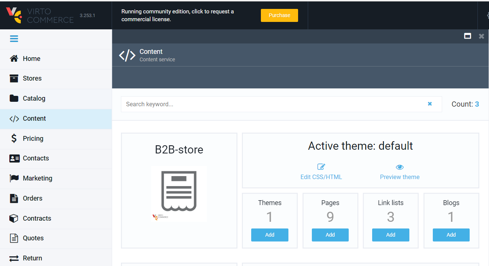

1. Select **Add** button in toolbar and select **Design Page** to create a new page.  

	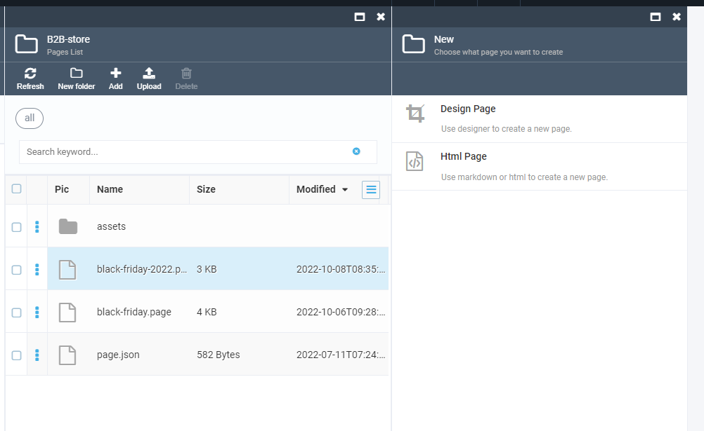

1. In the blade, type **File name**, **Name** - public page name, **Language** - optional and relative *Permalink* without domain.

	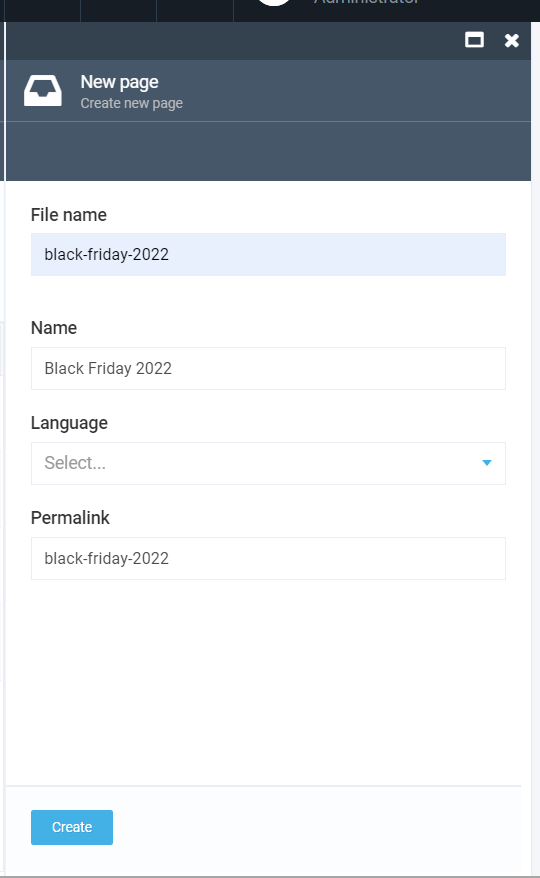

1.  Select **Create** button to creat a new page and open Page Builder in Design mode.

	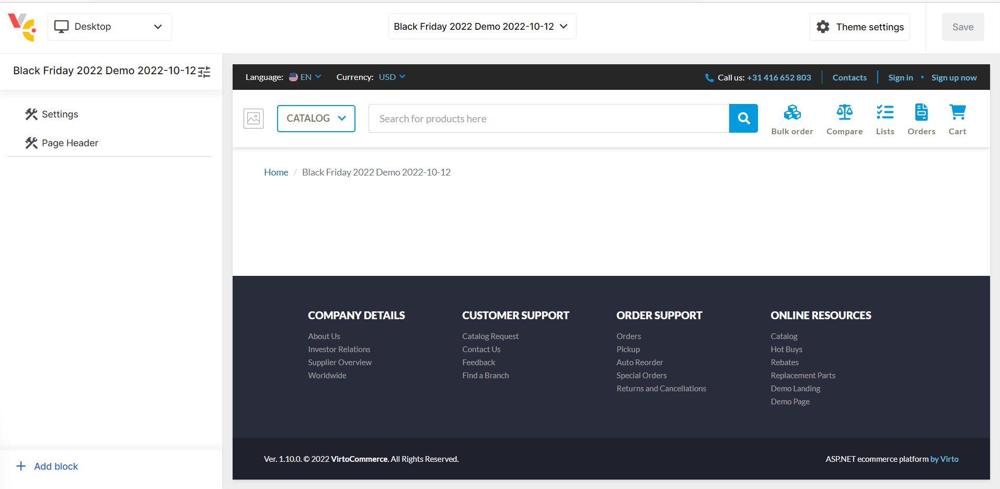

	Page Builder contains three main areas:

	1. Header - here you can find option to switch between different resolutions: Desktop, Desktop 50/50, Phone, Tablet and Fill screen.
	1. Edit Left Panel - Page and Block editor.
	1. Preview.

1. Select **Settings** and type page header (H1). 
1. Select **Page Header** and type SEO information: Title, Meta Description and Meta Keywords.

	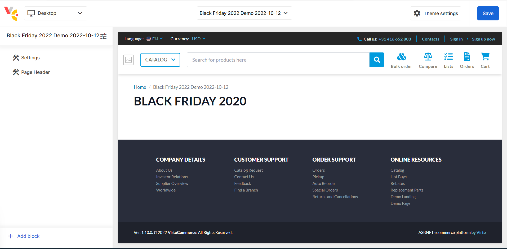

1. Now, you can save page and open it on the site by permalink.

	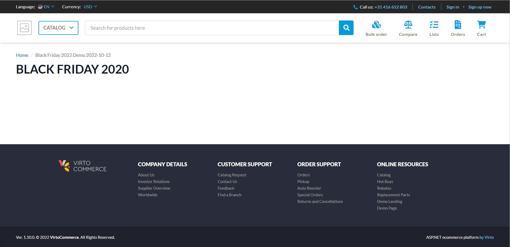

## Step 2. Add Content Blocks

1. Select **Add block** button to open **Block Library**.
	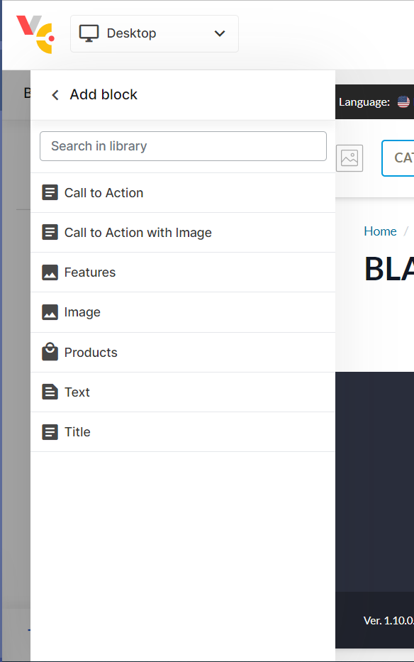
1. Select block and click **Add** button to add block into the page.  

Content blocks on Demo landing page will contains from:
1. Call to Action with Image.
1. Call to Action.

Both actions are redirecting customer to Catalog. 

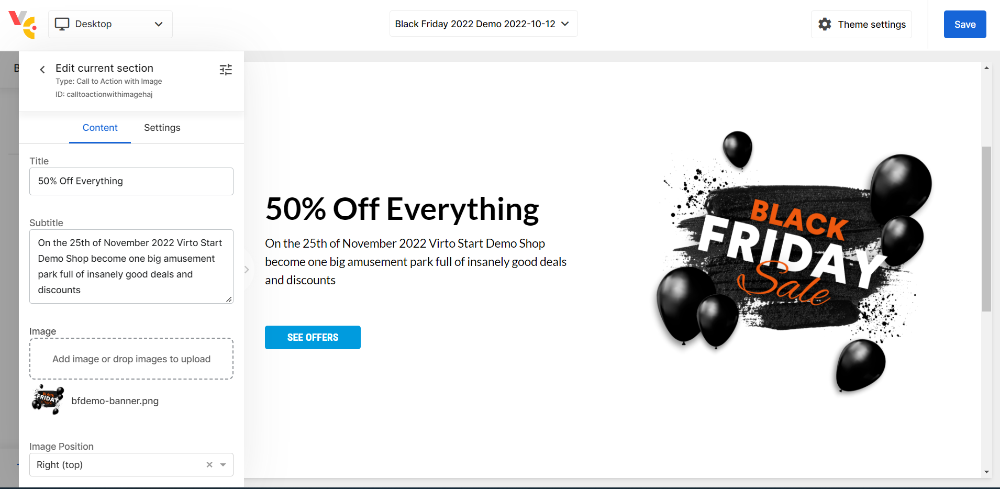

## Step 3. Add Products Block

Products block allows displaying a limited count of products with filter by keyword. In this scenario, we will use it to display promo products.

Products block read actual information from Catalog API. So, Page Builder can guarantee that any customer will see actual products, prices, stocks and designs as seen on a catalog.

1. Select **Add block** button to open **Block Library**.
1. Select Products block and click **Add** button to add block into the page.
1. Type Title, Subtitle, Search query and Count of the products.

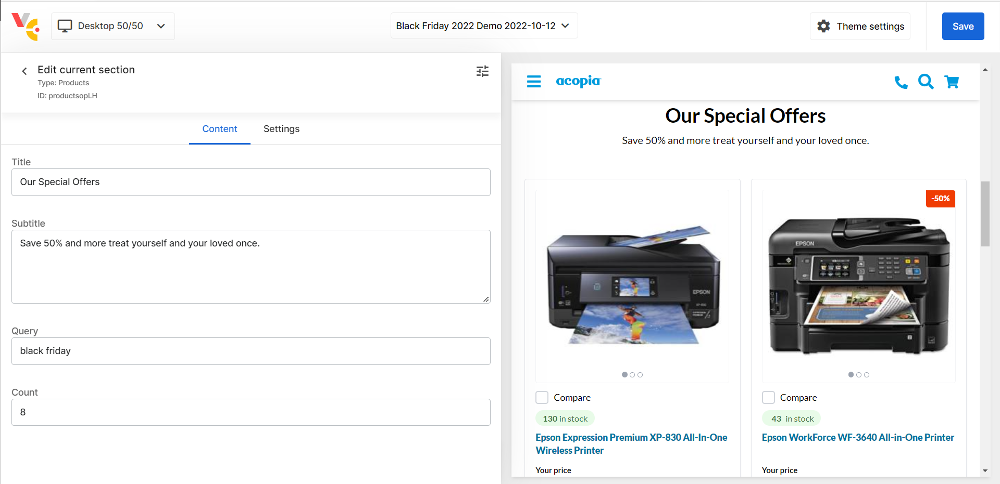

## Step 4. Publish Page

1. Select Save button to save page 
1. Open the page on the public site by permalink.

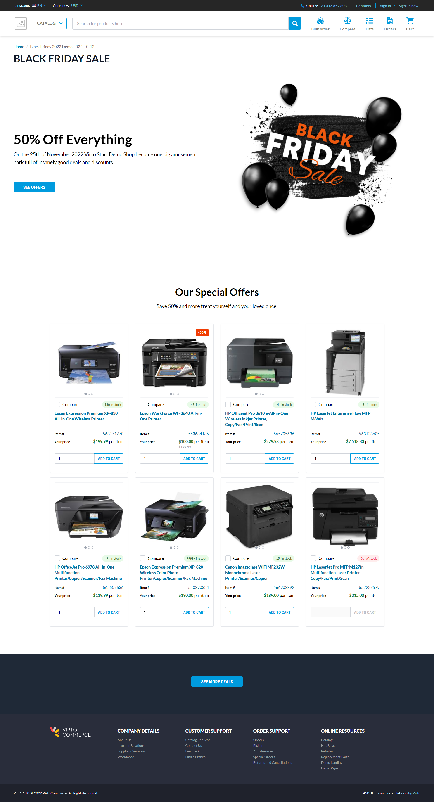

## Step 5. Adjust Products
We added actual products on the landing but if a marketer wants to adjust the result.

Here are several options, one of the solutions, is using Elastic App Search engines which are natively integrated with Virto Commerce. 

Elastic App Search supports Curations. Curations allow marketers to customize search results for specific queries. 

You need to create a new Curation for *black friday* keyword. Then you can use **Promoted results** to ensure that specified products always match a query and receive the highest relevance scores. 

Similarly, you can use **Hidden results** to exclude particular products from results.

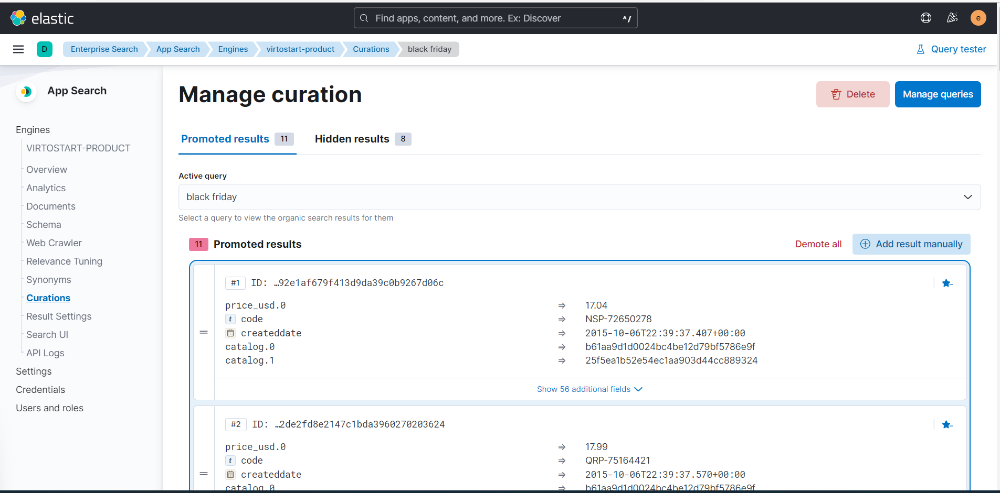

## Summary
In a few steps, we created and published Black Friday landing pages with actual product information. Then we use Curations to adjust product listing by keyword.

Because product data are loaded from Catalog API by keywords. You have rich options for catalog adjustments by Virto Catalog, Personalization and Native Search Engine Options.
