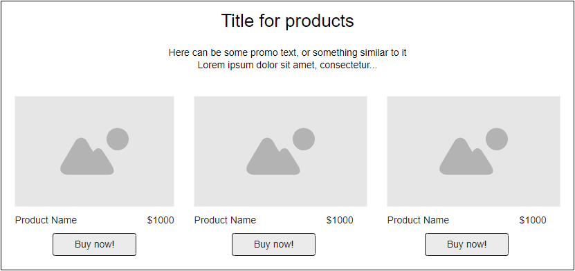
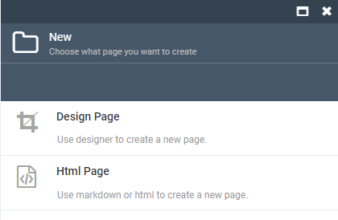
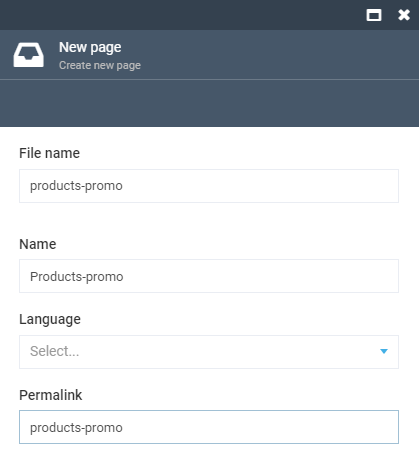
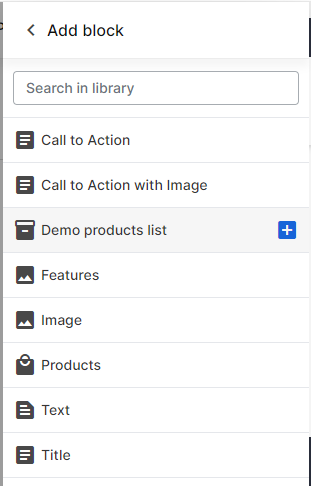
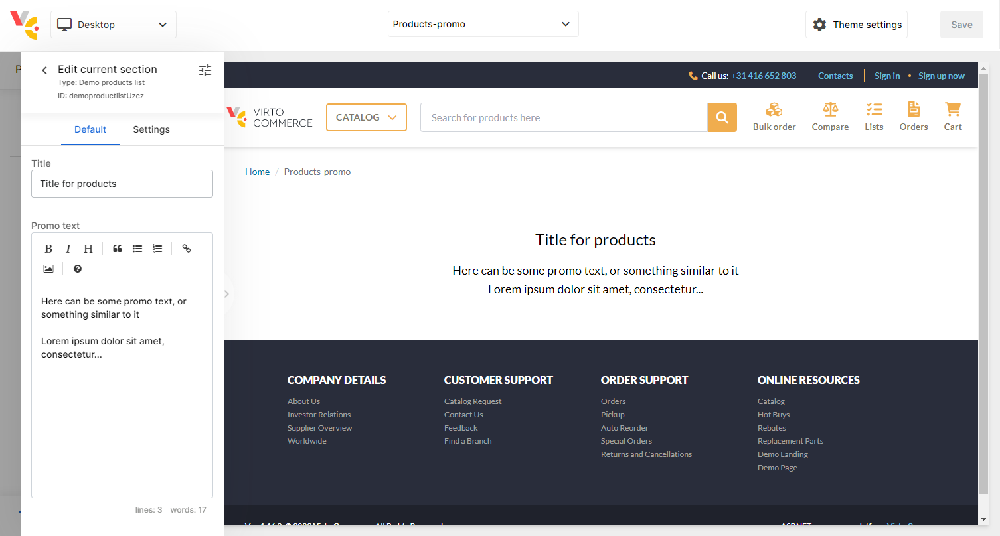
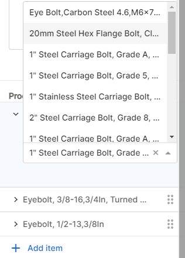
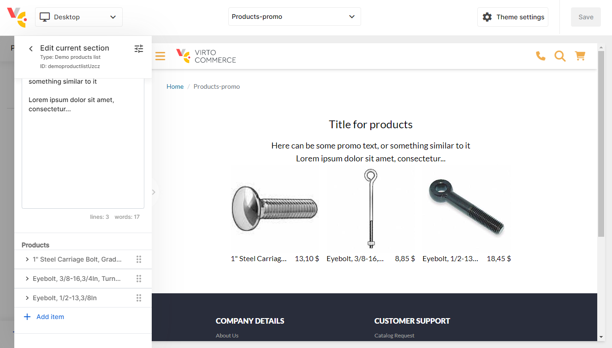

# Create new block. Step by step instructions.

## Intro

This tutorial will show you how to create a new block. Let's create a simple block that will display a selected products on the frontend.

## Step 1: Define block requirements

Let's say UI-designer draw the following mockup:



## Step 2: Define a list of properties

Here we have three property fields:
1. Title for block
1. Some description text, that can be rich-text.
1. Products list.

## Step 3: Create block descriptor

Each block has a descriptor file. It is a JSON file that contains all the information about the block. The file stored in the theme by path `/config/schemas/sections/<block-alias>.json`.

Let's name block `demo-product-list` and create file `demo-product-list.json` with the following content;

```json
{
  "name": "Demo products list",
  "icon": "inventory_2",
  "displayField": "name",
  "settings": [
    {
      "id": "title",
      "label": "Title",
      "type": "string",
      "default": "Title for products"
    },
    {
      "id": "content",
      "label": "Promo text",
      "type": "markdown",
      "resultType": "markdown",
      "default": "Here can be some promo text, or something similar to it\n\nLorem ipsum dolor sit amet, consectetur..."
    }
  ]
}
```
We have added just two fields for the first approach. The rest properties will be added later.

## Step 4: Add block to template descriptor.

There are many types of templates can be in theme. We must specify in which templates can the block be used.
So, we need to add block to the `page` template descriptor. Open file in theme placed at `/config/schemas/templates/page.json` and add block to the `sections` section.

```json
{
  ...
  "sections": [
    ...
    "demo-product-list"
  ]
  ...
}
```

## Step 5: Add block layout

The last step is to add block layout. The layout is a file that contains HTML markup and logic for the block. Thus we use the `vc-theme-b2b-vue` theme, that is built on Vue.js framework. The layout must be a Vue component.
Open theme and create file `/client-app/shared/static-content/components/demo-product-list.vue` with the following content.

todo: check the layout

```vue
<template>
  <div class="pt-6 pb-16">
    <div class="w-full max-w-screen-2xl mx-auto px-5 md:px-12">
      <h2 class="text-2xl">{{ model.title }}</h2>
      <div class="text-lg">
        <VcMarkdownRender :src="model.content" class="text-gray-500"></VcMarkdownRender>
      </div>
    </div>
  </div>
</template>

<script setup lang="ts">
defineProps({
  model: {
    type: Object,
    required: true,
  },
});
</script>
```

Next, register the new block in the theme. Open file `/client-app/shared/static-content/components/index.ts` and add the following line:

```ts
...
import DemoProductList from "./demo-product-list.vue";

const templateBlocks: { [key: string]: Component } = {
  ...
  "demo-product-list": DemoProductList,
};
...
```

Now we need to recompile theme. Open terminal in theme folder and run the following command:

```bash
yarn run build
```

## Step 6: Create new page and add the block to it.

Open the admin panel, then go to content of the current store, open pages list, clic `Add` on toolbar and select `Design page`.



Then fill out page data and click `Create` button on the bottom of the blade.



Now we need add new block onto page. Click `Add block` button on the left bottom in page builder and select `Demo products list` block.



The block has been added on the page, we can see it in the preview area.



## Step 7: Add property for products to the block

Now we need to add products to the block. Open the file with block settings and add the following item to the `settings` section:

```json
{
  ...
  "settings": [
    ...
    {
      "id": "products",
      "label": "Products",
      "type": "list",
      "default": [],
      "displayField": "product.name",
      "element": [
        {
          "id": "product",
          "label": "Product",
          "type": "select",
          "equalKey": "id",
          "request": {
            "url": "/graphql",
            "method": "post",
            "body": {
              "operationName": null,
              "variables": {},
              "query": "{products(storeId:\"{{location.params.storeId}}\"){items{id,code,name,imgSrc,prices{currency,list{formattedAmount}}}}}"
            },
            "cacheable": true,
            "response": {
              "result": "data.products.items"
            },
            "label": "name"
          }
        }
      ]
    }
  ]
}
```

Now we can get products in the page builder.



## The last step: Layout for products list

And the last step to complete block is the display products in the vue-component. Open the file with block layout and add the following code:

```vue
<div class="flex flex-row justify-center space-x-4">
  <div v-for="item in model.products" :key="item.product?.id" :product="item">
    <div v-show="item.product" class="flex flex-col w-48">
      <VcImage
        :src="item.product.imgSrc"
        :alt="item.product.name"
        size-suffix="md"
        class="w-full h-full rounded object-cover object-center select-none space-x-4"
      />
      <div class="flex flex-row space-x-4">
        <div class="grow truncate">{{ item.product.name }}</div>
        <div class="whitespace-nowrap">{{ item.product.prices[0].list.formattedAmount }}</div>
      </div>
    </div>
  </div>
</div>
```
And finaly we get result


