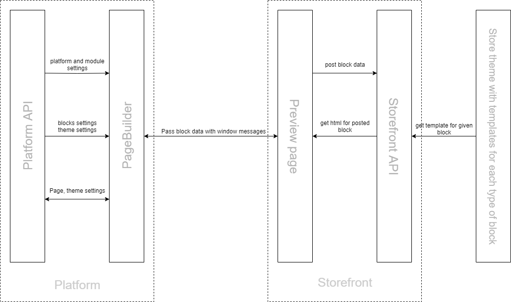
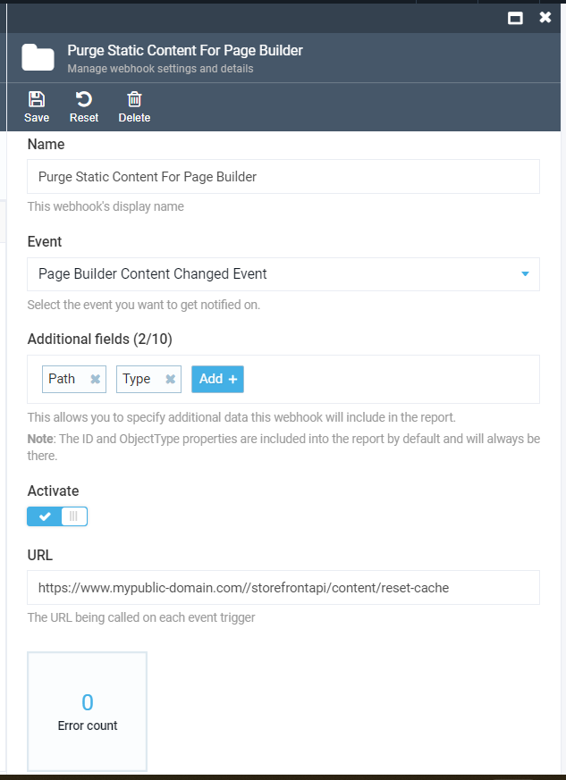

# Overview

The Page Builder allows creating ecommerce pages from blocks and editing them using a visual editor.

Each page consists of several different blocks. The block view and settings depend on web page requirements.

The page is created in the builder as a list of blocks with specific settings applied to each block. All data are saved in a Json file format.


## For Business
* Build e-commerce landing pages – simple and faster.
* Look at the content as the end customer see it.
* Mobile-friendliness by design.
* Ready-to-go building blocks and recommendations.

## For Developers
* Integratable into your unique design.
* Configurable set of favourites blocks. 
* More blocks. Less code. Create new blocks with flexible JSON schema.
* Can be integrated with your existing sites and apps.
* Ready for integration with DevOps.
* Ready for Publishing process.

## Key Features
* Build a new landing page visually without developer.
* Theme editor.
* Ecommerce page customization (Preview).
* Preview content.
* Block library.
* Seo by design.
* Mobile-friendliness by design
* Block management with Drag and drop, Copy, Paste, Hide, etc.
* Integration with Virto Storefront.
* Native Extendability Framework. 
* Permissions.

## Architecture

### Subsystem component description

The builder is consisted of two main subsystems:

1. Script with Creating logics;
1. Script with Preview visualization logics.

The Builder runs on admin side so that it can receive data from VC platform and save changes made during editing of pages and themes.

The Preview script runs on Storefront, as only Storefront 'knows' which templates should be used to generate the html.

The scripts 'communicate' with each other via messages- [`window.postMessage()`](https://developer.mozilla.org/en-US/docs/Web/API/Window/postMessage)



## Getting started

### Prerequisites
1. Virto Commerce 3.253+ (`vc-platform`)  [Quick start](https://docs.virtocommerce.org/vc-quickstart/)
1. Virto Storefront 6.7+ (`vc-storefront`).  [Deploy Storefront](https://docs.virtocommerce.org/getting-started/connect-storefront-to-platform-v3/)
1. Vue B2B Theme 1.10+ (`vc-theme-b2b-vue`). 
1. Page Builder Module 3.201+. [Download and Install](https://github.com/VirtoCommerce/vc-module-pagebuilder/releases). 

### Setup Content 
Check that Virto Commerce Platform and Storefront use same Shared Content folder.

### Setup Content Module
Content configuration should be extended with `PathMappings` section.

appsettings.json
```json
    "Content": {
        "PathMappings":{
            "pages": [
                "Themes",
                "_storeId",
                "_theme",
                "content/pages",
            ],
            "themes": [
                "Themes",
                "_storeId"
            ]
        }
    }
```

Environment Variables
```yaml
      Content__PathMappings__pages__0: "Themes"
      Content__PathMappings__pages__1: "_storeId"
      Content__PathMappings__pages__2: "_theme"
      Content__PathMappings__pages__3: "content/pages"
      Content__PathMappings__themes__0: "Themes"
      Content__PathMappings__themes__1: "_storeId"
```

### Setup Store
Public Store URL should be configured.


1. Open Virto Commerce Admin UI.
1. Select `Stores`.
1. Select Current Store.
1. Setup Store URL if it's empty
1. Click Save button to apply. 

### Purge Cache
You can purge static page from storefront cache by event. Otherwise, you will need to wait for cache expiration.

Virto Storefront has `/storefrontapi/content/reset-cache` end point for static page invalidation.

We recommend using Webhooks module.

1. Install `vc-module-webhooks` module.
1. Open Virto Commerce Admin UI.
1. Select Webhooks module.
1. Click `Add` button in toolbar to create a new webhook subscription.
1. Enter webhook subscription name.
1. Select `Page Builder Content Changed Event` event in Events drop-down.
1. Select `Path` and `Type` in additional fields.
1. Turn on `Activate` checkbox.
1. Enter Storefront end point in URL. Ex: https://www.mypublic-domain.com/storefrontapi/content/reset-cache
1. Save webhook subscription.



### Run
1. Open Virto Commerce Admin UI.
1. Select Content module.
1. Find Store and Select Pages widget.
1. Click `Add` button in toolbar. 
1. Select 'Design page'.
1. Provide page file name, public name and permalink. Ex: 'black-friday-2022', 'Black Friday 2022' and `blackfriday-2022`.
1. Click `Create` button

Now, you should be redirected to page builder application and you can create a first page.

Later, you can open and edit page builder pages, directly from content module.


