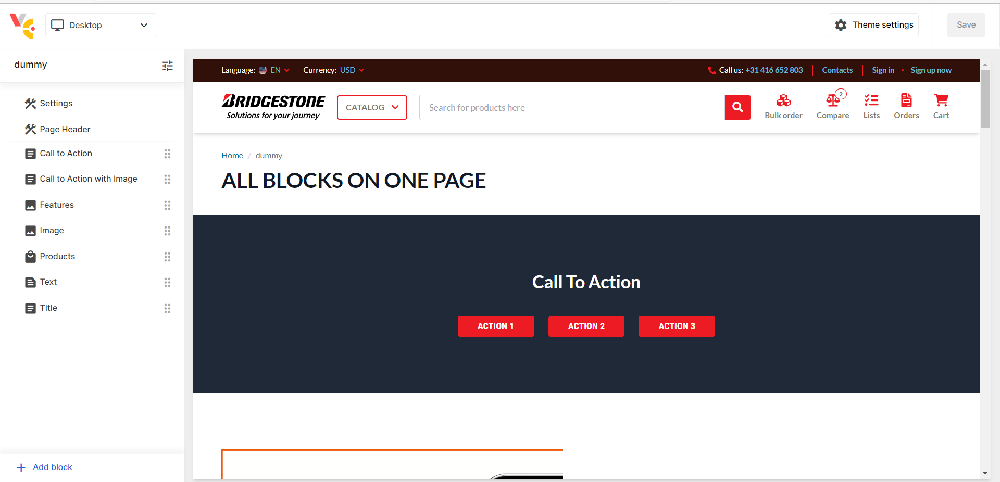
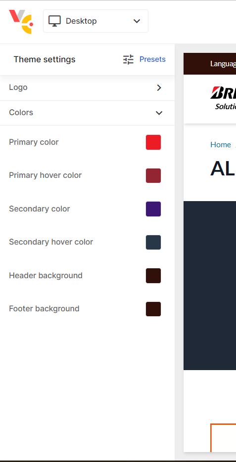
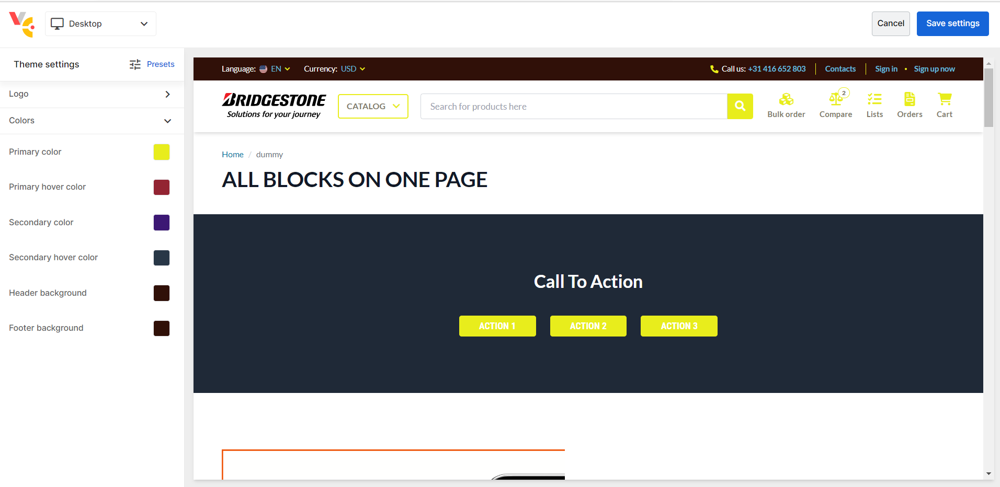
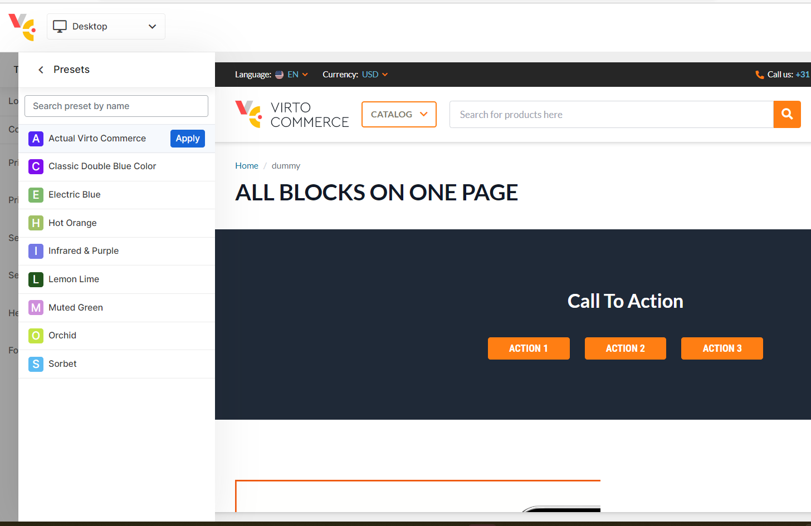

# Theme Editor

Theme configuration can help you adjust site branding either manually or by presets.

First, Theme editor helps to change site branding specifically for a marketing or advertising campaign, like christmas, black friday, etc.

Second, Theme editor allows you to make it easy for clients to customize their site based on the customer brand book.

Third, you can enrich theme and theme settings with feature flags and allow a Theme editor to customize it without developers.

## Grant Access to Theme Editor
Theme Editor is available for employees with `builder:theme` permission, only.

## Run Theme Editor
1. Open any page in the designer.
1. If you have `builder:theme` permission, you should see **Theme settings** button in the right top conner.
	
1. Click **Theme settings** button to activate Theme Editor.

## Theme Settings
The theme editor displays the settings which are available for modifications in the sidebar. 

By default, you have access to Logos and Colors modifications. 

You can adjust list of properties by modifying [settings_schema.json](https://github.com/VirtoCommerce/vc-theme-b2b-vue/blob/dev/config/settings_schema.json) file in the theme.

Change logo, colors and preview the results.

Finally, click **Save settings** button to apply modifications or click **Cancel** button to revert to the original state.

## Presets

A predefined list of presets simplifies switching between different configurations.

Select **Presets** in the Theme Editor sidebar to display list of available presets.

Select a preset and click **Apply** button for activation. 

You can adjust list of presets by modifying **settings_data.json** file in the theme.

For Vue B2B Theme, we created a custom preset set. You can download [2022 Vue B2B Preset Set here](media/settings_data.json)

## Summary
In a few steps, we changed site branding to custom and then activate predefine preset.